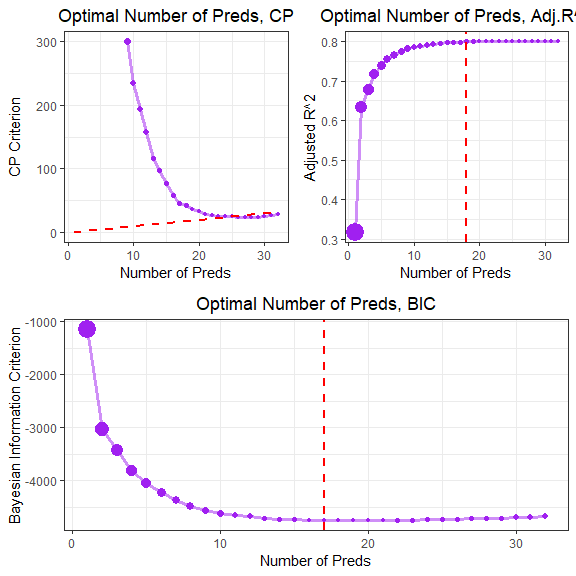
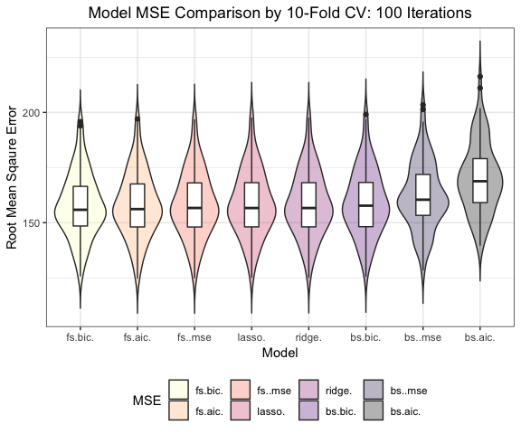

Forward, Backward Subset Selection - MSE
================
Quinton Neville
12/8/2018

Load, clean, manipulate, and tidy the data
==========================================

``` r
# Import data
cancer_raw = readr::read_csv("./Data/Cancer_Registry.csv") %>% 
  janitor::clean_names() 

#dim(cancer_raw)
#head(cancer_raw)

# Check NA values for each column
#n_NA = sapply(cancer_raw[1:34], function(x) sum(length(which(is.na(x)))))
#n_NA

# Check the percentage of NA values for each column
#percentage_NA = sapply(cancer_raw[1:34], function(x) sum(length(which(is.na(x)))) / nrow(cancer_raw))
#percentage_NA %>% data.frame()

#Pulling quartiles for study_per_cap categorical manipulation
study.quart <- with(cancer_raw, study_per_cap[study_per_cap > 0]) %>%
  quantile(., probs = c(0.25, 0.5, 0.75))

#To add a variable for region, state has too many factors for CV and data is not large enough for 51 fct var to be useful
#From data(state) built in R, going to left_join with cancer.df
#District of Columbia is missing, so I'm just going to impute it with the same factor as Maryland, 2
data(state)
state.df <- cbind(state.name, state.region) %>% as.tibble() %>% rename(state = state.name, region = state.region)

#Variable Manipulation
cancer.df <- cancer_raw %>%    #Remove Rows with > 20% missing 
  dplyr::select(-pct_some_col18_24) %>%  #Remove for too many missing
  mutate(
    pct_non_white = pct_black + pct_asian + pct_other_race, #Creating white, non-white percentages variables
    state = str_split_fixed(geography, ", ", 2)[ ,2] %>% as.factor(), #pulling state variable and casting as factor, possible region?
    binned_inc_lb = str_split_fixed(binned_inc, ", ", 2)[ ,1] %>% parse_number(), #pulling numeric lower bound
    binned_inc_ub = str_split_fixed(binned_inc, ", ", 2)[ ,2] %>% parse_number(), #pulling numeric upper bound
    binned_inc_point = (binned_inc_lb + binned_inc_ub)/2, #computing point estimate from ub,lb (intervals symmetric)
    study_quantile = ifelse(study_per_cap == 0, "None", 
                           ifelse(study_per_cap > 0 & study_per_cap <= study.quart[1], "Low", 
                                  ifelse(study_per_cap > study.quart[1] & study_per_cap <= study.quart[2], "Moderate", 
                                         ifelse(study_per_cap > study.quart[2] & study_per_cap <= study.quart[3], "High", 
                                                "Very High")))),
    study_quantile = as.factor(study_quantile) %>% fct_relevel(., "None", "Low", "Moderate", "High", "Very High"),
    avg_deaths_yr_pop = avg_deaths_per_year/pop_est2015,  #incorporate two vars into one (multicollinearity)
    avg_ann_count_pop = avg_ann_count/pop_est2015 #incorporate two vars into one (multicollinearity)
  ) %>%
  left_join(., state.df) %>%
  mutate(region = ifelse(is.na(region), 2, region),
         region = as.factor(region)) %>%
  dplyr::select(-c(binned_inc, geography, state, study_per_cap))

######TO avoid singular matrixes for our model fits, we need remove highly correlated and/or direct linear combos
###### Also lets make the response index 1, makes everything easier
cancer.df <- cancer.df %>%
  dplyr::select(-c(avg_deaths_per_year, avg_ann_count, pct_black, pct_asian, pct_other_race, binned_inc_lb, binned_inc_ub)) %>%
  dplyr::select(target_death_rate, everything())

#mostly need to decide between white/non-white or all race % AND binned_inc_lb, ub or median income
```

Note aboute study\_quantile breakdown (0 vs. numeric quantile). May be better as binary yes/no? But then we lose info.

``` r
cancer.df %>% group_by(study_quantile) %>% summarize(n = n()) %>% knitr::kable()
```

| study\_quantile |     n|
|:----------------|-----:|
| None            |  1931|
| Low             |   279|
| Moderate        |   279|
| High            |   279|
| Very High       |   279|

Imputing Values with less than 20% missing (two variables)
==========================================================

-   pct\_employed16\_over ~ 4%
-   pct\_private\_coverage\_alone ~ 20%

``` r
#Impute those missing less than 20%
#1. pct_employed16_over
#2. pct_private_coverage_alone

#Set up appropriate test and train for pct_employed16_over (removing other missing % variable and response (target death))
train.df <- cancer.df %>% dplyr::select(-c(pct_private_coverage_alone, target_death_rate)) %>% filter(!is.na(pct_employed16_over))
test.df <- cancer.df %>% dplyr::select(-c(pct_private_coverage_alone, target_death_rate)) %>% filter(is.na(pct_employed16_over))

#Function for imputation (after correct test, train set up), charstring must literally be the character of impute variable i.e. "var1"
impute.lasso <- function(train.df, test.df, charstring){

  if ((charstring %in% names(train.df))) {
    
#pull variable index
index <- which(names(train.df) == charstring)
  
#Set up Matrices
#Create Design Matrix Train
X <- train.df[ , -index] %>%
  names() %>% 
  paste(., collapse = "+") %>%    
  paste("~ ", .) %>%
  formula() %>%
  model.matrix(.,train.df)
  
#Create Design Matrix Test
X1 <- test.df[, -index] %>%
  names() %>% 
  paste(., collapse = "+") %>%    
  paste("~ ", .) %>%
  formula() %>%
  model.matrix(., test.df)

#Remove Intercept  
X <- X[,-1]
X1 <- X1[,-1]

#Create Response vector (as matrix)
Y <- train.df[, index] %>% as.matrix()

#Optimize lambda
lambda.grid <- 10^seq(-3,1,length = 100)

#CV n = 10
cv.lasso <- cv.glmnet(X, Y, alpha = 1, intercept = TRUE, lambda = lambda.grid, family = "gaussian")

#Grab optimal lambda
opt.lambda.lasso <- cv.lasso$lambda.min

#Run model
unemploy.lasso <- glmnet(X, Y, alpha = 1, intercept = TRUE, lambda = opt.lambda.lasso, family = "gaussian")

#Return predictions
predict(unemploy.lasso, newx = X1)
  }else{
    stop("Error: Incorrect variable name")
  }
}

#Impute employed16_over_preds (first since it has less missing data ~4%)
employed16_over_preds <- impute.lasso(train.df = train.df, test.df, "pct_employed16_over")

#Set up appropriate test and train
train.df <- cancer.df %>% dplyr::select(-c(pct_employed16_over, target_death_rate)) %>% filter(!is.na(pct_private_coverage_alone))
test.df <- cancer.df %>% dplyr::select(-c(pct_employed16_over, target_death_rate)) %>% filter(is.na(pct_private_coverage_alone))

#Impute pct_private_coverage_alone (second since it has more missing data ~20%)
pct_private_coverage_alone_preds <- impute.lasso(train.df = train.df, test.df, "pct_private_coverage_alone")

#Replace Imputed values
cancer.df <- cancer.df %>%
  mutate(imp_pct_employed16_over = ifelse(is.na(pct_employed16_over),
                                          employed16_over_preds, pct_employed16_over),
         imp_pct_private_coverage_alone = ifelse(is.na(pct_private_coverage_alone),
                                          pct_private_coverage_alone_preds, pct_private_coverage_alone)
        )

#Looks good, so we will replace imputed variables in our final data set
cancer.df <- cancer.df %>%
  dplyr::select(-c(pct_employed16_over, pct_private_coverage_alone))
```

See generally what the optimal number of preds in an lm() ought to be (CP, adj*R*<sup>2</sup>, BIC (similar to AIC)).

``` r
#Summary of models for each size (one model per size)
#Set max number of predictors
nvmax <- ncol(cancer.df) - 1
reg.subsets <- cancer.df %>% 
  regsubsets(target_death_rate ~ ., data = ., really.big = FALSE, nvmax = nvmax)
rs <- summary(reg.subsets)

# Plots of Cp and Adj-R2 as functions of parameters
r.df <- tibble(
  preds = 1:nvmax,
  cp = rs$cp,
  adjr2 = rs$adjr2,
  bic = rs$bic,
  step = 1:nvmax
)

cp.plot <- r.df %>% ggplot(aes(x = preds, y = cp, size = cp)) +
  geom_point(colour = "purple") +
  geom_line(alpha = 0.5, colour = "purple", size = 1.25) +
 # geom_point(aes(x = preds, step),color = "black",size = 0.5) +
  geom_line(aes(x = preds, step), size = 1, color = "red") +
  labs(
    x = "Number of Preds",
    y = "CP Criterion",
    title = "Optimal Number of Preds, CP"
  ) + 
  ylim(c(0, 300)) + 
  theme(legend.position = "none") 

adjr2.plot <- r.df %>% ggplot(aes(x = preds, y = adjr2, size = 1 - adjr2)) +
  geom_point(colour = "purple") +
  geom_line(alpha = 0.5, colour = "purple", size = 1.25) +
  labs(
    x = "Number of Preds",
    y = "Adjusted R^2",
    title = "Optimal Number of Preds, Adj.R^2"
  ) + theme(legend.position = "none")

bic.plot <- r.df %>% ggplot(aes(x = preds, y = bic, size = bic)) +
  geom_point(colour = "purple") +
  geom_line(alpha = 0.5, colour = "purple", size = 1.25) +
  labs(
    x = "Number of Preds",
    y = "Bayesian Information Criterion",
    title = "Optimal Number of Preds, BIC"
  ) + theme(legend.position = "none")

(cp.plot + adjr2.plot) / bic.plot
```



Based on the plots above, *C**P* criterion in the upper left with *p* ≤ *C**P* constraint in red, that somewhere around a 25-27 predictor model ought to be optimal. With respect to adjusted *R*<sup>2</sup>, it appears as though we reach a converging maximum starting around 20 and negligible increase after, where additional predictors have diminishing marginal return. Lastly, BIC is more conservative (penalizing more strongly for more predictors) and seems to suggest between a 15-20 predictor model (closer to 20). This may inform our subset selection criterion.

K-fold cross validation funciton for subset selecion (MSE, AIC, BIC criterion)
==============================================================================

``` r
sampleSize <- nrow(cancer.df)

mseCV <- function(data.df, kfolds = 10){
  folds <- sample(1:kfolds, sampleSize, rep = T)
  mse <- rep(0, kfolds)
  for (k in 1:kfolds) {
    train.df <- data.df[folds != k,]
    test.df <- data.df[folds == k,]
    
    lm.mod <- lm(target_death_rate ~ ., data = train.df)
    preds <- predict(lm.mod, newdata = test.df)
    mse[k] <- with(test.df,mean((target_death_rate - preds)^2))
  }
  mean(mse)
}

aicCV <- function(data.df, kfolds = 10){
  folds <- sample(1:kfolds, sampleSize, rep = T)
  aic <- rep(0, kfolds)
  for (k in 1:kfolds) {
    train.df <- data.df[folds != k,]
    test.df <- data.df[folds == k,]
    
    lm.mod <- lm(target_death_rate ~ ., data = train.df)
    aic[k] <- AIC(lm.mod)
  }
  mean(aic)
}

bicCV <- function(data.df, kfolds = 10){
  folds <- sample(1:kfolds, sampleSize, rep = T)
  bic <- rep(0, kfolds)
  for (k in 1:kfolds) {
    train.df <- data.df[folds != k,]
    test.df <- data.df[folds == k,]
    
    lm.mod <- lm(target_death_rate ~ ., data = train.df)
    bic[k] <- BIC(lm.mod)
  }
  mean(bic)
}
```

Forward Subset Selection with k-Fold CV and MSE criterion
=========================================================

Function to run the subset algorithm, it will output the variable selection process so you visualize how it works. Comment out the set seed to get true variability in the subsets, only leave it in for reproducibility.

-   The function `f.subset.mse(sub.cancer.df, maxPreds = 10, nfolds = 5)` takes in a data frame, max number of predictors you want the algorithm to run through (can't be larger than the number of predictors in the data frame), and the number of folds for the cross validation.

##### Note mustreorder data frame so response is the first column of the data frame (see above code chunk)

##### Also have to take out state variable, too many factor levels and CV process can fail (re add later to see if it's useful)

-   The way the algorithm works is

1.  Starts with an empty (null) set of current predictors in the data frame input
2.  Starts with a full set of available predictors
3.  Loops through all available preds and adds one at a time, splits the data into kfolds test/train (CV), fits lm() with current preds, stores MSE
4.  Selects the predictor whose CV MSE was smallest
5.  Adds 'best' predictor to current predictors, removes it from available predictors
6.  Stores that predictor set as 'best' and records the indices and CV MSE in a matrix
7.  Repeats 3.- 5. until you have met the maximum number of predictors you specified
8.  Returns a list with all 'best' predictor sets at each iteration, matrix of results, and prespecified max preds
9.  Last few lines of code output the optimal (minimum MSE) predictor set

*notes - CV is set to 5 for speed, changing to 10 will take ~1.5 times as long to run* *notes - the print() lines within the function are so you can visualize how the algorithm is working, they can be commented out to reduce clutter when you want to run the selection function iteratively (avoids reams of output)*

``` r
#Forward Subset#
#set.seed(4) #Comment this out if you want to really get a different subset each time

#Function
#inputs:
#full data frame (whatever that ends up being)
#maximum number you want to look at subsets up to (no larger than p)
#Number of folds for the cross validation step, 10 is a little slow but better for final paper
#criterion to minimize -  either "mse", or "aic". Must put those in just as they appear with "

f.subset <- function(sub.cancer.df, maxPreds = 10, nfolds = 5, criterion = "mse") {

#number of possible predictors
## Allthe predictors (their indices).
allPreds <- 1:ncol(sub.cancer.df)
allPreds <- allPreds[-1] #substract the response

#current set of preds (starts empty), and available
currPreds <- c()
availPreds <- setdiff(allPreds,currPreds)
#Record the min errors
minError <- c()
#Initalize pred list and mse result matrix (just for storage)
pred.list <- list()
result.mat <- matrix(nrow = ncol(cancer.df) - 1, ncol = 2)
#Initalize iteration
i <- 1
#Forward selection loop
while (length(currPreds) < maxPreds) {
  ##add predictor which decreases MSE (as determined by CV or
  ##Bootstrapping)
  ## The MSE/AIC computed as we add each of the available predictors
  allError <- c()
  for (id in availPreds) {
    data.df <- sub.cancer.df[,c(currPreds,id,1)] #Only the preds we want in the df
    if (criterion == "mse") {
      error <- mseCV(data.df, nfolds)  #cross validate mse for the model with the added pred
    } else if (criterion == "aic") {
      error <- aicCV(data.df, nfolds) #same but with AIC
    } else if (criterion == "bic") {
      error <- bicCV(data.df, nfolds) #same bic
    } else {
      print("Invalid criterion")
      stop("Wrong criterion input")
    }
    allError <- c(allError,error)  #Collect all the errors for every variable added
  }
  ##Find the min
  id <- which.min(allError)
  ##get the best predictor and lowest MSE/AIC
  bestPred <- availPreds[id]
  bestError <- min(allError)
  ##Add these into the collection
  currPreds <- c(currPreds,bestPred)
  minError <- c(minError,bestError)
  ##Take out the pred you just added from consideration
  availPreds <- setdiff(allPreds,currPreds)
  ## Print stuff out for debugging and attention-grabbing
  print(sprintf("Iteration: %i Predictor Added: %s %s Value: %s",i, names(sub.cancer.df[,bestPred]), criterion, bestError))
  print(currPreds)
  result.mat[i,] <- c(bestPred,bestError)         #You can also comment out all print() later, it's just to watch the algorithm work
  pred.list[[i]] <- currPreds
  i <- i + 1
    }
  return(list(pred.list = pred.list, result.mat = result.mat, maxPreds = maxPreds)) #returns list of preds, results, and max num preds
}

#Run Subset, call function, output is a list with predictor sets, reslut matrix and maxPreds
f.mse.list <- f.subset(cancer.df, maxPreds = ncol(cancer.df) - 1, nfolds = 5, criterion = "mse")
```

    ## [1] "Iteration: 1 Predictor Added: avg_deaths_yr_pop mse Value: 527.239211508234"
    ## [1] 27
    ## [1] "Iteration: 2 Predictor Added: median_age_female mse Value: 283.232086114618"
    ## [1] 27  8
    ## [1] "Iteration: 3 Predictor Added: region mse Value: 245.090046881746"
    ## [1] 27  8 29
    ## [1] "Iteration: 4 Predictor Added: incidence_rate mse Value: 217.532790803931"
    ## [1] 27  8 29  2
    ## [1] "Iteration: 5 Predictor Added: pct_unemployed16_over mse Value: 201.811776562737"
    ## [1] 27  8 29  2 16
    ## [1] "Iteration: 6 Predictor Added: pct_hs18_24 mse Value: 190.271790062583"
    ## [1] 27  8 29  2 16 12
    ## [1] "Iteration: 7 Predictor Added: pct_emp_priv_coverage mse Value: 181.541569842547"
    ## [1] 27  8 29  2 16 12 18
    ## [1] "Iteration: 8 Predictor Added: pct_private_coverage mse Value: 174.998282063775"
    ## [1] 27  8 29  2 16 12 18 17
    ## [1] "Iteration: 9 Predictor Added: binned_inc_point mse Value: 171.525857427778"
    ## [1] 27  8 29  2 16 12 18 17 25
    ## [1] "Iteration: 10 Predictor Added: median_age_male mse Value: 168.14074784776"
    ##  [1] 27  8 29  2 16 12 18 17 25  7
    ## [1] "Iteration: 11 Predictor Added: avg_ann_count_pop mse Value: 166.201964884269"
    ##  [1] 27  8 29  2 16 12 18 17 25  7 28
    ## [1] "Iteration: 12 Predictor Added: imp_pct_employed16_over mse Value: 166.240300944597"
    ##  [1] 27  8 29  2 16 12 18 17 25  7 28 30
    ## [1] "Iteration: 13 Predictor Added: pct_hs25_over mse Value: 164.882781975635"
    ##  [1] 27  8 29  2 16 12 18 17 25  7 28 30 14
    ## [1] "Iteration: 14 Predictor Added: pct_public_coverage mse Value: 163.597971080364"
    ##  [1] 27  8 29  2 16 12 18 17 25  7 28 30 14 19
    ## [1] "Iteration: 15 Predictor Added: pct_public_coverage_alone mse Value: 159.967543322675"
    ##  [1] 27  8 29  2 16 12 18 17 25  7 28 30 14 19 20
    ## [1] "Iteration: 16 Predictor Added: study_quantile mse Value: 158.863603307045"
    ##  [1] 27  8 29  2 16 12 18 17 25  7 28 30 14 19 20 26
    ## [1] "Iteration: 17 Predictor Added: med_income mse Value: 158.485916920555"
    ##  [1] 27  8 29  2 16 12 18 17 25  7 28 30 14 19 20 26  3
    ## [1] "Iteration: 18 Predictor Added: median_age mse Value: 158.479360970946"
    ##  [1] 27  8 29  2 16 12 18 17 25  7 28 30 14 19 20 26  3  6
    ## [1] "Iteration: 19 Predictor Added: pct_no_hs18_24 mse Value: 159.711838111368"
    ##  [1] 27  8 29  2 16 12 18 17 25  7 28 30 14 19 20 26  3  6 11
    ## [1] "Iteration: 20 Predictor Added: birth_rate mse Value: 158.884117074106"
    ##  [1] 27  8 29  2 16 12 18 17 25  7 28 30 14 19 20 26  3  6 11 23
    ## [1] "Iteration: 21 Predictor Added: pct_white mse Value: 158.592545539145"
    ##  [1] 27  8 29  2 16 12 18 17 25  7 28 30 14 19 20 26  3  6 11 23 21
    ## [1] "Iteration: 22 Predictor Added: pct_non_white mse Value: 157.75493371137"
    ##  [1] 27  8 29  2 16 12 18 17 25  7 28 30 14 19 20 26  3  6 11 23 21 24
    ## [1] "Iteration: 23 Predictor Added: pct_bach_deg18_24 mse Value: 158.624236282205"
    ##  [1] 27  8 29  2 16 12 18 17 25  7 28 30 14 19 20 26  3  6 11 23 21 24 13
    ## [1] "Iteration: 24 Predictor Added: percent_married mse Value: 157.890218765148"
    ##  [1] 27  8 29  2 16 12 18 17 25  7 28 30 14 19 20 26  3  6 11 23 21 24 13
    ## [24] 10
    ## [1] "Iteration: 25 Predictor Added: pct_married_households mse Value: 157.625489638478"
    ##  [1] 27  8 29  2 16 12 18 17 25  7 28 30 14 19 20 26  3  6 11 23 21 24 13
    ## [24] 10 22
    ## [1] "Iteration: 26 Predictor Added: poverty_percent mse Value: 157.404008484086"
    ##  [1] 27  8 29  2 16 12 18 17 25  7 28 30 14 19 20 26  3  6 11 23 21 24 13
    ## [24] 10 22  5
    ## [1] "Iteration: 27 Predictor Added: avg_household_size mse Value: 157.904303299881"
    ##  [1] 27  8 29  2 16 12 18 17 25  7 28 30 14 19 20 26  3  6 11 23 21 24 13
    ## [24] 10 22  5  9
    ## [1] "Iteration: 28 Predictor Added: pct_bach_deg25_over mse Value: 157.171335198253"
    ##  [1] 27  8 29  2 16 12 18 17 25  7 28 30 14 19 20 26  3  6 11 23 21 24 13
    ## [24] 10 22  5  9 15
    ## [1] "Iteration: 29 Predictor Added: imp_pct_private_coverage_alone mse Value: 158.333455691331"
    ##  [1] 27  8 29  2 16 12 18 17 25  7 28 30 14 19 20 26  3  6 11 23 21 24 13
    ## [24] 10 22  5  9 15 31
    ## [1] "Iteration: 30 Predictor Added: pop_est2015 mse Value: 158.631000792173"
    ##  [1] 27  8 29  2 16 12 18 17 25  7 28 30 14 19 20 26  3  6 11 23 21 24 13
    ## [24] 10 22  5  9 15 31  4

``` r
f.aic.list <- f.subset(cancer.df, maxPreds = ncol(cancer.df) - 1, nfolds = 5, criterion = "aic")
```

    ## [1] "Iteration: 1 Predictor Added: avg_deaths_yr_pop aic Value: 22198.8239858059"
    ## [1] 27
    ## [1] "Iteration: 2 Predictor Added: median_age_female aic Value: 20684.7408686787"
    ## [1] 27  8
    ## [1] "Iteration: 3 Predictor Added: region aic Value: 20328.4004073051"
    ## [1] 27  8 29
    ## [1] "Iteration: 4 Predictor Added: incidence_rate aic Value: 20038.5080285658"
    ## [1] 27  8 29  2
    ## [1] "Iteration: 5 Predictor Added: pct_unemployed16_over aic Value: 19846.1540172878"
    ## [1] 27  8 29  2 16
    ## [1] "Iteration: 6 Predictor Added: pct_hs18_24 aic Value: 19699.4989527198"
    ## [1] 27  8 29  2 16 12
    ## [1] "Iteration: 7 Predictor Added: pct_emp_priv_coverage aic Value: 19593.6427554369"
    ## [1] 27  8 29  2 16 12 18
    ## [1] "Iteration: 8 Predictor Added: pct_private_coverage aic Value: 19496.4527858076"
    ## [1] 27  8 29  2 16 12 18 17
    ## [1] "Iteration: 9 Predictor Added: binned_inc_point aic Value: 19445.639634311"
    ## [1] 27  8 29  2 16 12 18 17 25
    ## [1] "Iteration: 10 Predictor Added: median_age_male aic Value: 19408.3844508033"
    ##  [1] 27  8 29  2 16 12 18 17 25  7
    ## [1] "Iteration: 11 Predictor Added: pct_hs25_over aic Value: 19375.6695163659"
    ##  [1] 27  8 29  2 16 12 18 17 25  7 14
    ## [1] "Iteration: 12 Predictor Added: avg_ann_count_pop aic Value: 19351.644250043"
    ##  [1] 27  8 29  2 16 12 18 17 25  7 14 28
    ## [1] "Iteration: 13 Predictor Added: pct_public_coverage aic Value: 19338.8120883203"
    ##  [1] 27  8 29  2 16 12 18 17 25  7 14 28 19
    ## [1] "Iteration: 14 Predictor Added: pct_public_coverage_alone aic Value: 19292.5578553196"
    ##  [1] 27  8 29  2 16 12 18 17 25  7 14 28 19 20
    ## [1] "Iteration: 15 Predictor Added: imp_pct_employed16_over aic Value: 19264.3287277892"
    ##  [1] 27  8 29  2 16 12 18 17 25  7 14 28 19 20 30
    ## [1] "Iteration: 16 Predictor Added: birth_rate aic Value: 19256.1194526454"
    ##  [1] 27  8 29  2 16 12 18 17 25  7 14 28 19 20 30 23
    ## [1] "Iteration: 17 Predictor Added: pct_no_hs18_24 aic Value: 19253.6174256228"
    ##  [1] 27  8 29  2 16 12 18 17 25  7 14 28 19 20 30 23 11
    ## [1] "Iteration: 18 Predictor Added: med_income aic Value: 19250.6999926675"
    ##  [1] 27  8 29  2 16 12 18 17 25  7 14 28 19 20 30 23 11  3
    ## [1] "Iteration: 19 Predictor Added: percent_married aic Value: 19246.3009399411"
    ##  [1] 27  8 29  2 16 12 18 17 25  7 14 28 19 20 30 23 11  3 10
    ## [1] "Iteration: 20 Predictor Added: pct_bach_deg25_over aic Value: 19241.2908014062"
    ##  [1] 27  8 29  2 16 12 18 17 25  7 14 28 19 20 30 23 11  3 10 15
    ## [1] "Iteration: 21 Predictor Added: pct_non_white aic Value: 19235.0750220721"
    ##  [1] 27  8 29  2 16 12 18 17 25  7 14 28 19 20 30 23 11  3 10 15 24
    ## [1] "Iteration: 22 Predictor Added: pct_white aic Value: 19220.5633028441"
    ##  [1] 27  8 29  2 16 12 18 17 25  7 14 28 19 20 30 23 11  3 10 15 24 21
    ## [1] "Iteration: 23 Predictor Added: imp_pct_private_coverage_alone aic Value: 19216.4238852161"
    ##  [1] 27  8 29  2 16 12 18 17 25  7 14 28 19 20 30 23 11  3 10 15 24 21 31
    ## [1] "Iteration: 24 Predictor Added: pct_married_households aic Value: 19213.9353146614"
    ##  [1] 27  8 29  2 16 12 18 17 25  7 14 28 19 20 30 23 11  3 10 15 24 21 31
    ## [24] 22
    ## [1] "Iteration: 25 Predictor Added: study_quantile aic Value: 19214.0881556852"
    ##  [1] 27  8 29  2 16 12 18 17 25  7 14 28 19 20 30 23 11  3 10 15 24 21 31
    ## [24] 22 26
    ## [1] "Iteration: 26 Predictor Added: pct_bach_deg18_24 aic Value: 19216.9280988194"
    ##  [1] 27  8 29  2 16 12 18 17 25  7 14 28 19 20 30 23 11  3 10 15 24 21 31
    ## [24] 22 26 13
    ## [1] "Iteration: 27 Predictor Added: median_age aic Value: 19218.8067625491"
    ##  [1] 27  8 29  2 16 12 18 17 25  7 14 28 19 20 30 23 11  3 10 15 24 21 31
    ## [24] 22 26 13  6
    ## [1] "Iteration: 28 Predictor Added: pop_est2015 aic Value: 19218.6670160115"
    ##  [1] 27  8 29  2 16 12 18 17 25  7 14 28 19 20 30 23 11  3 10 15 24 21 31
    ## [24] 22 26 13  6  4
    ## [1] "Iteration: 29 Predictor Added: avg_household_size aic Value: 19221.4968282592"
    ##  [1] 27  8 29  2 16 12 18 17 25  7 14 28 19 20 30 23 11  3 10 15 24 21 31
    ## [24] 22 26 13  6  4  9
    ## [1] "Iteration: 30 Predictor Added: poverty_percent aic Value: 19225.2813163957"
    ##  [1] 27  8 29  2 16 12 18 17 25  7 14 28 19 20 30 23 11  3 10 15 24 21 31
    ## [24] 22 26 13  6  4  9  5

``` r
f.bic.list <- f.subset(cancer.df, maxPreds = ncol(cancer.df) - 1, nfolds = 5, criterion = "bic")
```

    ## [1] "Iteration: 1 Predictor Added: avg_deaths_yr_pop bic Value: 22215.9726535984"
    ## [1] 27
    ## [1] "Iteration: 2 Predictor Added: median_age_female bic Value: 20708.0746975113"
    ## [1] 27  8
    ## [1] "Iteration: 3 Predictor Added: region bic Value: 20369.3043711639"
    ## [1] 27  8 29
    ## [1] "Iteration: 4 Predictor Added: incidence_rate bic Value: 20084.8652301516"
    ## [1] 27  8 29  2
    ## [1] "Iteration: 5 Predictor Added: pct_unemployed16_over bic Value: 19898.8373164137"
    ## [1] 27  8 29  2 16
    ## [1] "Iteration: 6 Predictor Added: pct_hs18_24 bic Value: 19757.1815871531"
    ## [1] 27  8 29  2 16 12
    ## [1] "Iteration: 7 Predictor Added: pct_emp_priv_coverage bic Value: 19656.5336087814"
    ## [1] 27  8 29  2 16 12 18
    ## [1] "Iteration: 8 Predictor Added: pct_private_coverage bic Value: 19565.0148540039"
    ## [1] 27  8 29  2 16 12 18 17
    ## [1] "Iteration: 9 Predictor Added: binned_inc_point bic Value: 19519.884899862"
    ## [1] 27  8 29  2 16 12 18 17 25
    ## [1] "Iteration: 10 Predictor Added: median_age_male bic Value: 19485.7276183719"
    ##  [1] 27  8 29  2 16 12 18 17 25  7
    ## [1] "Iteration: 11 Predictor Added: pct_hs25_over bic Value: 19462.8662522004"
    ##  [1] 27  8 29  2 16 12 18 17 25  7 14
    ## [1] "Iteration: 12 Predictor Added: avg_ann_count_pop bic Value: 19442.4251049862"
    ##  [1] 27  8 29  2 16 12 18 17 25  7 14 28
    ## [1] "Iteration: 13 Predictor Added: pct_public_coverage bic Value: 19439.8508075213"
    ##  [1] 27  8 29  2 16 12 18 17 25  7 14 28 19
    ## [1] "Iteration: 14 Predictor Added: pct_public_coverage_alone bic Value: 19398.420699773"
    ##  [1] 27  8 29  2 16 12 18 17 25  7 14 28 19 20
    ## [1] "Iteration: 15 Predictor Added: imp_pct_employed16_over bic Value: 19374.1999024431"
    ##  [1] 27  8 29  2 16 12 18 17 25  7 14 28 19 20 30
    ## [1] "Iteration: 16 Predictor Added: birth_rate bic Value: 19373.5823399422"
    ##  [1] 27  8 29  2 16 12 18 17 25  7 14 28 19 20 30 23
    ## [1] "Iteration: 17 Predictor Added: pct_no_hs18_24 bic Value: 19375.3878217997"
    ##  [1] 27  8 29  2 16 12 18 17 25  7 14 28 19 20 30 23 11
    ## [1] "Iteration: 18 Predictor Added: percent_married bic Value: 19378.4622766383"
    ##  [1] 27  8 29  2 16 12 18 17 25  7 14 28 19 20 30 23 11 10
    ## [1] "Iteration: 19 Predictor Added: pct_married_households bic Value: 19376.9906282721"
    ##  [1] 27  8 29  2 16 12 18 17 25  7 14 28 19 20 30 23 11 10 22
    ## [1] "Iteration: 20 Predictor Added: imp_pct_private_coverage_alone bic Value: 19380.7942792599"
    ##  [1] 27  8 29  2 16 12 18 17 25  7 14 28 19 20 30 23 11 10 22 31
    ## [1] "Iteration: 21 Predictor Added: pct_non_white bic Value: 19385.0943386847"
    ##  [1] 27  8 29  2 16 12 18 17 25  7 14 28 19 20 30 23 11 10 22 31 24
    ## [1] "Iteration: 22 Predictor Added: pct_white bic Value: 19375.6056537891"
    ##  [1] 27  8 29  2 16 12 18 17 25  7 14 28 19 20 30 23 11 10 22 31 24 21
    ## [1] "Iteration: 23 Predictor Added: pct_bach_deg25_over bic Value: 19374.8567933688"
    ##  [1] 27  8 29  2 16 12 18 17 25  7 14 28 19 20 30 23 11 10 22 31 24 21 15
    ## [1] "Iteration: 24 Predictor Added: pct_bach_deg18_24 bic Value: 19375.6361020636"
    ##  [1] 27  8 29  2 16 12 18 17 25  7 14 28 19 20 30 23 11 10 22 31 24 21 15
    ## [24] 13
    ## [1] "Iteration: 25 Predictor Added: avg_household_size bic Value: 19385.8135962097"
    ##  [1] 27  8 29  2 16 12 18 17 25  7 14 28 19 20 30 23 11 10 22 31 24 21 15
    ## [24] 13  9
    ## [1] "Iteration: 26 Predictor Added: med_income bic Value: 19392.0774396623"
    ##  [1] 27  8 29  2 16 12 18 17 25  7 14 28 19 20 30 23 11 10 22 31 24 21 15
    ## [24] 13  9  3
    ## [1] "Iteration: 27 Predictor Added: poverty_percent bic Value: 19395.2980916091"
    ##  [1] 27  8 29  2 16 12 18 17 25  7 14 28 19 20 30 23 11 10 22 31 24 21 15
    ## [24] 13  9  3  5
    ## [1] "Iteration: 28 Predictor Added: pop_est2015 bic Value: 19404.1136846082"
    ##  [1] 27  8 29  2 16 12 18 17 25  7 14 28 19 20 30 23 11 10 22 31 24 21 15
    ## [24] 13  9  3  5  4
    ## [1] "Iteration: 29 Predictor Added: median_age bic Value: 19406.7727447668"
    ##  [1] 27  8 29  2 16 12 18 17 25  7 14 28 19 20 30 23 11 10 22 31 24 21 15
    ## [24] 13  9  3  5  4  6
    ## [1] "Iteration: 30 Predictor Added: study_quantile bic Value: 19437.7963752833"
    ##  [1] 27  8 29  2 16 12 18 17 25  7 14 28 19 20 30 23 11 10 22 31 24 21 15
    ## [24] 13  9  3  5  4  6 26

``` r
#Show the 'best' final selection with minimal MSE (takes in a list object from the previous function, with criterion (MSE/AIC))
present.fs.result <- function(f.result.list, criterion) {
lm.fs.preds <- with(f.result.list, pred.list[[which.min(result.mat[,2])]]) #Pick out indices from best model
fs.mse <- with(f.result.list, result.mat[which.min(result.mat[,2]), 2])
print(sprintf("The best predictor set of %s predictors, out of a max of %s, (%s = %s)",
              length(lm.fs.preds), f.result.list$maxPreds, criterion, round(fs.mse, 3)))
print(names(cancer.df[,c(lm.fs.preds)]))
}

#Show the final results and subset selections, with CV criterion stats
present.fs.result(f.mse.list, "MSE")
```

    ## [1] "The best predictor set of 28 predictors, out of a max of 30, (MSE = 157.171)"
    ##  [1] "avg_deaths_yr_pop"         "median_age_female"        
    ##  [3] "region"                    "incidence_rate"           
    ##  [5] "pct_unemployed16_over"     "pct_hs18_24"              
    ##  [7] "pct_emp_priv_coverage"     "pct_private_coverage"     
    ##  [9] "binned_inc_point"          "median_age_male"          
    ## [11] "avg_ann_count_pop"         "imp_pct_employed16_over"  
    ## [13] "pct_hs25_over"             "pct_public_coverage"      
    ## [15] "pct_public_coverage_alone" "study_quantile"           
    ## [17] "med_income"                "median_age"               
    ## [19] "pct_no_hs18_24"            "birth_rate"               
    ## [21] "pct_white"                 "pct_non_white"            
    ## [23] "pct_bach_deg18_24"         "percent_married"          
    ## [25] "pct_married_households"    "poverty_percent"          
    ## [27] "avg_household_size"        "pct_bach_deg25_over"

``` r
present.fs.result(f.aic.list, "AIC")
```

    ## [1] "The best predictor set of 24 predictors, out of a max of 30, (AIC = 19213.935)"
    ##  [1] "avg_deaths_yr_pop"              "median_age_female"             
    ##  [3] "region"                         "incidence_rate"                
    ##  [5] "pct_unemployed16_over"          "pct_hs18_24"                   
    ##  [7] "pct_emp_priv_coverage"          "pct_private_coverage"          
    ##  [9] "binned_inc_point"               "median_age_male"               
    ## [11] "pct_hs25_over"                  "avg_ann_count_pop"             
    ## [13] "pct_public_coverage"            "pct_public_coverage_alone"     
    ## [15] "imp_pct_employed16_over"        "birth_rate"                    
    ## [17] "pct_no_hs18_24"                 "med_income"                    
    ## [19] "percent_married"                "pct_bach_deg25_over"           
    ## [21] "pct_non_white"                  "pct_white"                     
    ## [23] "imp_pct_private_coverage_alone" "pct_married_households"

``` r
present.fs.result(f.bic.list, "BIC")
```

    ## [1] "The best predictor set of 16 predictors, out of a max of 30, (BIC = 19373.582)"
    ##  [1] "avg_deaths_yr_pop"         "median_age_female"        
    ##  [3] "region"                    "incidence_rate"           
    ##  [5] "pct_unemployed16_over"     "pct_hs18_24"              
    ##  [7] "pct_emp_priv_coverage"     "pct_private_coverage"     
    ##  [9] "binned_inc_point"          "median_age_male"          
    ## [11] "pct_hs25_over"             "avg_ann_count_pop"        
    ## [13] "pct_public_coverage"       "pct_public_coverage_alone"
    ## [15] "imp_pct_employed16_over"   "birth_rate"

``` r
#Pull the indices for the selected models, for later comparison
fs.mse.preds <- with(f.mse.list, pred.list[[which.min(result.mat[,2])]])
fs.aic.preds <- with(f.aic.list, pred.list[[which.min(result.mat[,2])]])
fs.bic.preds <- with(f.bic.list,  pred.list[[which.min(result.mat[,2])]])
```

If you want to repeat the process to get a feel for what you think might actually be the best of the 'best' subset selections (they very slightly from iteration to iteration by cross validation). Pick the number of iterations `len` and let the chunk run, you can see the process work (reccomend commenting out the print() calls in the functions above to reduce all the extra output), then at the end it will print all the subsets selected and you can sift through which variables you want for a final subset model. See which ones get selected most often basically.

``` r
#Repeat if you want to
#Number of repetitions
len <- 10
f.result.list <- list()

#Repeat Subset Selection algorithm
for (i in 1:len) {
  f.result.list[[i]] <- f.subset(sub.cancer.df, maxPreds = 10, nfolds = 5, criterion = "mse")
}

#View the results
for (i in 1:len) {
present.fs.result(f.result.list[[i]], "MSE")
}

#See which vars seem to be selected most often, make a subjective call what subset you like best.

#fs.lm <- lm(target_death_rate ~ ., data = cancer.df[,c(lm.fs.preds,1)])
```

Repeat the process for Backwards Subset
=======================================

NOTE this will take much longer to run
--------------------------------------

##### Again must reorder data frame so response is the first column of the data frame (see above code chunk)

##### Again state variable removed, too many factor levels and CV process can fail (re add later to see if it's useful)

-   The way the algorithm works is

1.  Starts with an exhaustive set of current predictors in the data frame input (all preds in the data frame)
2.  Starts with a empty set of predictors removed
3.  Loops through all current preds and removes one at a time, splits the data into kfolds test/train (CV), fits lm() with current preds, stores MSE
4.  Selects the set whose CV MSE was smallest
5.  The optimal set had one of the predictors removed, selects that predictor as 'worst; removes it from current predictors
6.  Stores that predictor set as worst and records the indices and CV MSE in a matrix for the model without that pred
7.  Repeats 3.- 5. until you have met the minimum number of predictors you specified
8.  Returns a list with all 'best' predictor sets at each iteration, matrix of results, and prespecified max preds
9.  Last few lines of code output the optimal (minimum MSE) predictor set

*notes - CV is set to 5 for speed, changing to 10 will take ~1.5 times as long to run* *notes - the print() lines within the function are so you can visualize how the algorithm is working, they can be commented out to reduce clutter when you want to run the selection function iteratively (avoids reams of output)*

``` r
#Backward Selection
#set.seed(4444)  #Set seed for reproducibility
###############################################

#Num all possible preds
maxPreds <- ncol(cancer.df - 1)

#Function
#Inputs:
#full data set (whatever that ends up being, ideally non-singular)
#minimum number of preds you want the algorithm to reduce subsets to
#Number of folds for CV step
#Criterion to minimize: "mse" or "aic"

b.subset <- function(sub.cancer.df, minPreds = 1, nfolds = 5, criterion = "mse"){

## Allthe predictors (their indices).
allPreds <- 1:ncol(sub.cancer.df)
allPreds <- allPreds[-1] #take out response

#current set of preds (starts full), and available
currPreds <- allPreds
availPreds <- allPreds
#Record the min errors
minError <- c()
#Set up storage objects
pred.list <- list()
result.mat <- matrix(nrow = ncol(sub.cancer.df) - 1, ncol = 2)
#initialize iteration
i <- 1
#Forward selection loop
while (length(currPreds) >= minPreds) {
  ##remove predictor which has CV lm with lowest MSE/AIC (as determined by CV)
  ## The MSE/AIC computed as we remove of the available predictors
  allError <- c()
  for (id in availPreds) {
    data.df <- sub.cancer.df[,c(currPreds[-id],1)]  #Take data frame without the predictor were removing
    if (criterion == "mse") {
      error <- mseCV(data.df, nfolds)  #calculate CV mse
    } else if (criterion == "aic") {
      error <- aicCV(data.df, nfolds)  #calculate CV aic
    } else if (criterion == "bic") {
      error <- bicCV(data.df, nfolds)  # CV bic
    } else {
      print("Invalid criterion")
      stop("Wrong criterion input")
    }
    allError <- c(allError,error)  #Collect all our criterions (error is misleading, can be mse or aic)
  }
  ##Find the min
  id <- which.min(allError)
  ##get the worst predictor and MSE
  worstPred <- availPreds[id]
  bestError <- min(allError)
  ##Remove these from the collection
  currPreds <- currPreds[-id]
  minError <- c(minError, bestError)
  availPreds <- currPreds
  ## Print stuff out for debugging and attention-grabbing
  print(sprintf("Predictor Removed: %s  %s Value: %s",names(sub.cancer.df[,worstPred]), criterion, bestError))
  print(currPreds)
  result.mat[i,] <- c(worstPred,bestError)   #All print() can be commented out at any time, just to visualize alg. process
  pred.list[[i]] <- currPreds
  
  i <- i + 1
  }
  list(pred.list = pred.list, result.mat = result.mat)
}

#Call functions, output is a list of preds and a result matrix of criterion and predictor removed
b.mse.list <- b.subset(cancer.df, minPreds = 10, nfolds = 5, criterion = "mse")
```

    ## [1] "Predictor Removed: pct_white  mse Value: 157.561319247403"
    ##  [1]  2  3  4  5  6  7  8  9 10 11 12 13 14 15 16 17 18 19 20 22 23 24 25
    ## [24] 26 27 28 29 30 31
    ## [1] "Predictor Removed: imp_pct_private_coverage_alone  mse Value: 157.772258734951"
    ##  [1]  2  3  4  5  6  7  8  9 10 11 12 13 14 15 16 17 18 19 20 22 23 24 25
    ## [24] 26 27 28 29 30
    ## [1] "Predictor Removed: pop_est2015  mse Value: 158.503376470067"
    ##  [1]  2  3  5  6  7  8  9 10 11 12 13 14 15 16 17 18 19 20 22 23 24 25 26
    ## [24] 27 28 29 30
    ## [1] "Predictor Removed: avg_ann_count_pop  mse Value: 158.243931050223"
    ##  [1]  2  3  5  6  7  8  9 10 11 12 13 14 15 16 17 18 19 20 22 23 24 25 26
    ## [24] 27 29 30
    ## [1] "Predictor Removed: study_quantile  mse Value: 159.878706440786"
    ##  [1]  2  3  5  6  7  8  9 10 11 12 13 14 15 16 17 18 19 20 22 23 24 25 27
    ## [24] 29 30
    ## [1] "Predictor Removed: pct_no_hs18_24  mse Value: 160.273621408258"
    ##  [1]  2  3  5  6  7  8  9 10 12 13 14 15 16 17 18 19 20 22 23 24 25 27 29
    ## [24] 30
    ## [1] "Predictor Removed: pct_emp_priv_coverage  mse Value: 159.54262385044"
    ##  [1]  2  3  5  6  7  8  9 10 12 13 14 15 16 17 19 20 22 23 24 25 27 29 30
    ## [1] "Predictor Removed: pct_non_white  mse Value: 160.224532157938"
    ##  [1]  2  3  5  6  7  8  9 10 12 13 14 15 16 17 19 20 22 23 25 27 29 30
    ## [1] "Predictor Removed: avg_deaths_yr_pop  mse Value: 161.714159469785"
    ##  [1]  2  3  5  6  7  8  9 10 12 13 14 15 16 17 19 20 22 23 25 29 30
    ## [1] "Predictor Removed: median_age_male  mse Value: 365.888632167404"
    ##  [1]  2  3  5  6  8  9 10 12 13 14 15 16 17 19 20 22 23 25 29 30
    ## [1] "Predictor Removed: birth_rate  mse Value: 366.518934473602"
    ##  [1]  2  3  5  6  8  9 10 12 13 14 15 16 17 19 20 22 25 29 30
    ## [1] "Predictor Removed: med_income  mse Value: 368.605338979251"
    ##  [1]  2  5  6  8  9 10 12 13 14 15 16 17 19 20 22 25 29 30
    ## [1] "Predictor Removed: binned_inc_point  mse Value: 368.868391248403"
    ##  [1]  2  5  6  8  9 10 12 13 14 15 16 17 19 20 22 29 30
    ## [1] "Predictor Removed: pct_hs18_24  mse Value: 369.449120940883"
    ##  [1]  2  5  6  8  9 10 13 14 15 16 17 19 20 22 29 30
    ## [1] "Predictor Removed: poverty_percent  mse Value: 373.104372312184"
    ##  [1]  2  6  8  9 10 13 14 15 16 17 19 20 22 29 30
    ## [1] "Predictor Removed: percent_married  mse Value: 371.611571597551"
    ##  [1]  2  6  8  9 13 14 15 16 17 19 20 22 29 30
    ## [1] "Predictor Removed: pct_unemployed16_over  mse Value: 374.911257485194"
    ##  [1]  2  6  8  9 13 14 15 17 19 20 22 29 30
    ## [1] "Predictor Removed: pct_married_households  mse Value: 375.393858834818"
    ##  [1]  2  6  8  9 13 14 15 17 19 20 29 30
    ## [1] "Predictor Removed: incidence_rate  mse Value: 380.89471195791"
    ##  [1]  6  8  9 13 14 15 17 19 20 29 30
    ## [1] "Predictor Removed: pct_public_coverage_alone  mse Value: 489.167805347134"
    ##  [1]  6  8  9 13 14 15 17 19 29 30
    ## [1] "Predictor Removed: pct_public_coverage  mse Value: 493.932814312949"
    ## [1]  6  8  9 13 14 15 17 29 30

``` r
b.aic.list <- b.subset(cancer.df, minPreds = 10, nfolds = 5, criterion = "aic")
```

    ## [1] "Predictor Removed: pct_hs18_24  aic Value: 19217.5051467432"
    ##  [1]  2  3  4  5  6  7  8  9 10 11 13 14 15 16 17 18 19 20 21 22 23 24 25
    ## [24] 26 27 28 29 30 31
    ## [1] "Predictor Removed: pct_non_white  aic Value: 19276.9003587826"
    ##  [1]  2  3  4  5  6  7  8  9 10 11 13 14 15 16 17 18 19 20 21 22 23 25 26
    ## [24] 27 28 29 30 31
    ## [1] "Predictor Removed: birth_rate  aic Value: 19301.8991856546"
    ##  [1]  2  3  4  5  6  7  8  9 10 11 13 14 15 16 17 18 19 20 21 22 25 26 27
    ## [24] 28 29 30 31
    ## [1] "Predictor Removed: pct_married_households  aic Value: 19304.669189606"
    ##  [1]  2  3  4  5  6  7  8  9 10 11 13 14 15 16 17 18 19 20 21 25 26 27 28
    ## [24] 29 30 31
    ## [1] "Predictor Removed: poverty_percent  aic Value: 19306.4429815548"
    ##  [1]  2  3  4  6  7  8  9 10 11 13 14 15 16 17 18 19 20 21 25 26 27 28 29
    ## [24] 30 31
    ## [1] "Predictor Removed: pct_public_coverage_alone  aic Value: 19305.1623932779"
    ##  [1]  2  3  4  6  7  8  9 10 11 13 14 15 16 17 18 19 21 25 26 27 28 29 30
    ## [24] 31
    ## [1] "Predictor Removed: percent_married  aic Value: 19366.6417205129"
    ##  [1]  2  3  4  6  7  8  9 11 13 14 15 16 17 18 19 21 25 26 27 28 29 30 31
    ## [1] "Predictor Removed: pop_est2015  aic Value: 19367.1123123065"
    ##  [1]  2  3  6  7  8  9 11 13 14 15 16 17 18 19 21 25 26 27 28 29 30 31
    ## [1] "Predictor Removed: pct_private_coverage  aic Value: 19369.0323146415"
    ##  [1]  2  3  6  7  8  9 11 13 14 15 16 18 19 21 25 26 27 28 29 30 31
    ## [1] "Predictor Removed: median_age_female  aic Value: 19485.6691300592"
    ##  [1]  2  3  6  7  9 11 13 14 15 16 18 19 21 25 26 27 28 29 30 31
    ## [1] "Predictor Removed: pct_bach_deg25_over  aic Value: 19778.1580375964"
    ##  [1]  2  3  6  7  9 11 13 14 16 18 19 21 25 26 27 28 29 30 31
    ## [1] "Predictor Removed: pct_public_coverage  aic Value: 19792.2008172709"
    ##  [1]  2  3  6  7  9 11 13 14 16 18 21 25 26 27 28 29 30 31
    ## [1] "Predictor Removed: med_income  aic Value: 19790.3858128034"
    ##  [1]  2  6  7  9 11 13 14 16 18 21 25 26 27 28 29 30 31
    ## [1] "Predictor Removed: study_quantile  aic Value: 19791.7900351722"
    ##  [1]  2  6  7  9 11 13 14 16 18 21 25 27 28 29 30 31
    ## [1] "Predictor Removed: incidence_rate  aic Value: 19790.2734872077"
    ##  [1]  6  7  9 11 13 14 16 18 21 25 27 28 29 30 31
    ## [1] "Predictor Removed: pct_white  aic Value: 20042.652534433"
    ##  [1]  6  7  9 11 13 14 16 18 25 27 28 29 30 31
    ## [1] "Predictor Removed: pct_emp_priv_coverage  aic Value: 20043.5493546446"
    ##  [1]  6  7  9 11 13 14 16 25 27 28 29 30 31
    ## [1] "Predictor Removed: avg_deaths_yr_pop  aic Value: 20100.1574723969"
    ##  [1]  6  7  9 11 13 14 16 25 28 29 30 31
    ## [1] "Predictor Removed: imp_pct_private_coverage_alone  aic Value: 22030.4274444951"
    ##  [1]  6  7  9 11 13 14 16 25 28 29 30
    ## [1] "Predictor Removed: region  aic Value: 22031.1205531282"
    ##  [1]  6  7  9 11 13 14 16 25 28 30
    ## [1] "Predictor Removed: pct_unemployed16_over  aic Value: 22214.6918414489"
    ## [1]  6  7  9 11 13 14 25 28 30

``` r
b.bic.list <- b.subset(cancer.df, minPreds = 10, nfolds = 5, criterion = "bic")
```

    ## [1] "Predictor Removed: binned_inc_point  bic Value: 19413.2679567799"
    ##  [1]  2  3  4  5  6  7  8  9 10 11 12 13 14 15 16 17 18 19 20 21 22 23 24
    ## [24] 26 27 28 29 30 31
    ## [1] "Predictor Removed: pct_non_white  bic Value: 19413.7404926786"
    ##  [1]  2  3  4  5  6  7  8  9 10 11 12 13 14 15 16 17 18 19 20 21 22 23 26
    ## [24] 27 28 29 30 31
    ## [1] "Predictor Removed: birth_rate  bic Value: 19433.5397254999"
    ##  [1]  2  3  4  5  6  7  8  9 10 11 12 13 14 15 16 17 18 19 20 21 22 26 27
    ## [24] 28 29 30 31
    ## [1] "Predictor Removed: pct_married_households  bic Value: 19432.5466076001"
    ##  [1]  2  3  4  5  6  7  8  9 10 11 12 13 14 15 16 17 18 19 20 21 26 27 28
    ## [24] 29 30 31
    ## [1] "Predictor Removed: pct_white  bic Value: 19426.2669819038"
    ##  [1]  2  3  4  5  6  7  8  9 10 11 12 13 14 15 16 17 18 19 20 26 27 28 29
    ## [24] 30 31
    ## [1] "Predictor Removed: pct_public_coverage_alone  bic Value: 19420.5675933543"
    ##  [1]  2  3  4  5  6  7  8  9 10 11 12 13 14 15 16 17 18 19 26 27 28 29 30
    ## [24] 31
    ## [1] "Predictor Removed: pct_public_coverage  bic Value: 19472.2048068631"
    ##  [1]  2  3  4  5  6  7  8  9 10 11 12 13 14 15 16 17 18 26 27 28 29 30 31
    ## [1] "Predictor Removed: pct_emp_priv_coverage  bic Value: 19482.3241839369"
    ##  [1]  2  3  4  5  6  7  8  9 10 11 12 13 14 15 16 17 26 27 28 29 30 31
    ## [1] "Predictor Removed: pct_private_coverage  bic Value: 19562.3604586391"
    ##  [1]  2  3  4  5  6  7  8  9 10 11 12 13 14 15 16 26 27 28 29 30 31
    ## [1] "Predictor Removed: pct_unemployed16_over  bic Value: 19571.2669913783"
    ##  [1]  2  3  4  5  6  7  8  9 10 11 12 13 14 15 26 27 28 29 30 31
    ## [1] "Predictor Removed: pct_bach_deg25_over  bic Value: 19663.7547788563"
    ##  [1]  2  3  4  5  6  7  8  9 10 11 12 13 14 26 27 28 29 30 31
    ## [1] "Predictor Removed: pct_hs25_over  bic Value: 19671.3810269778"
    ##  [1]  2  3  4  5  6  7  8  9 10 11 12 13 26 27 28 29 30 31
    ## [1] "Predictor Removed: pct_bach_deg18_24  bic Value: 19717.0349139196"
    ##  [1]  2  3  4  5  6  7  8  9 10 11 12 26 27 28 29 30 31
    ## [1] "Predictor Removed: pct_hs18_24  bic Value: 19711.3833906114"
    ##  [1]  2  3  4  5  6  7  8  9 10 11 26 27 28 29 30 31
    ## [1] "Predictor Removed: pct_no_hs18_24  bic Value: 19886.0395727212"
    ##  [1]  2  3  4  5  6  7  8  9 10 26 27 28 29 30 31
    ## [1] "Predictor Removed: percent_married  bic Value: 19886.5412561154"
    ##  [1]  2  3  4  5  6  7  8  9 26 27 28 29 30 31
    ## [1] "Predictor Removed: avg_household_size  bic Value: 19887.9352530942"
    ##  [1]  2  3  4  5  6  7  8 26 27 28 29 30 31
    ## [1] "Predictor Removed: median_age_female  bic Value: 19893.6184200119"
    ##  [1]  2  3  4  5  6  7 26 27 28 29 30 31
    ## [1] "Predictor Removed: median_age_male  bic Value: 20200.7834045384"
    ##  [1]  2  3  4  5  6 26 27 28 29 30 31
    ## [1] "Predictor Removed: median_age  bic Value: 21024.779873162"
    ##  [1]  2  3  4  5 26 27 28 29 30 31
    ## [1] "Predictor Removed: poverty_percent  bic Value: 21019.7064264821"
    ## [1]  2  3  4 26 27 28 29 30 31

``` r
#Visualize function takes in a list object from the last function
present.bs.result <- function(result.list, criterion) {
lm.bs.preds <- with(result.list, pred.list[[which.min(result.mat[,2])]])
lm.bs.mse <- with(result.list, result.mat[which.min(result.mat[,2]), 2])
print(sprintf("The best predictor set of %s predictors, out of a max of %s, (%s = %s)",
              length(lm.bs.preds), maxPreds, criterion, round(lm.bs.mse, 3)))
names(cancer.df[,c(lm.bs.preds)])
}

#Present the final subsets which were selected
present.bs.result(b.mse.list, "MSE")
```

    ## [1] "The best predictor set of 29 predictors, out of a max of 31, (MSE = 157.561)"

    ##  [1] "incidence_rate"                 "med_income"                    
    ##  [3] "pop_est2015"                    "poverty_percent"               
    ##  [5] "median_age"                     "median_age_male"               
    ##  [7] "median_age_female"              "avg_household_size"            
    ##  [9] "percent_married"                "pct_no_hs18_24"                
    ## [11] "pct_hs18_24"                    "pct_bach_deg18_24"             
    ## [13] "pct_hs25_over"                  "pct_bach_deg25_over"           
    ## [15] "pct_unemployed16_over"          "pct_private_coverage"          
    ## [17] "pct_emp_priv_coverage"          "pct_public_coverage"           
    ## [19] "pct_public_coverage_alone"      "pct_married_households"        
    ## [21] "birth_rate"                     "pct_non_white"                 
    ## [23] "binned_inc_point"               "study_quantile"                
    ## [25] "avg_deaths_yr_pop"              "avg_ann_count_pop"             
    ## [27] "region"                         "imp_pct_employed16_over"       
    ## [29] "imp_pct_private_coverage_alone"

``` r
present.bs.result(b.aic.list, "AIC")
```

    ## [1] "The best predictor set of 29 predictors, out of a max of 31, (AIC = 19217.505)"

    ##  [1] "incidence_rate"                 "med_income"                    
    ##  [3] "pop_est2015"                    "poverty_percent"               
    ##  [5] "median_age"                     "median_age_male"               
    ##  [7] "median_age_female"              "avg_household_size"            
    ##  [9] "percent_married"                "pct_no_hs18_24"                
    ## [11] "pct_bach_deg18_24"              "pct_hs25_over"                 
    ## [13] "pct_bach_deg25_over"            "pct_unemployed16_over"         
    ## [15] "pct_private_coverage"           "pct_emp_priv_coverage"         
    ## [17] "pct_public_coverage"            "pct_public_coverage_alone"     
    ## [19] "pct_white"                      "pct_married_households"        
    ## [21] "birth_rate"                     "pct_non_white"                 
    ## [23] "binned_inc_point"               "study_quantile"                
    ## [25] "avg_deaths_yr_pop"              "avg_ann_count_pop"             
    ## [27] "region"                         "imp_pct_employed16_over"       
    ## [29] "imp_pct_private_coverage_alone"

``` r
present.bs.result(b.bic.list, "BIC")
```

    ## [1] "The best predictor set of 29 predictors, out of a max of 31, (BIC = 19413.268)"

    ##  [1] "incidence_rate"                 "med_income"                    
    ##  [3] "pop_est2015"                    "poverty_percent"               
    ##  [5] "median_age"                     "median_age_male"               
    ##  [7] "median_age_female"              "avg_household_size"            
    ##  [9] "percent_married"                "pct_no_hs18_24"                
    ## [11] "pct_hs18_24"                    "pct_bach_deg18_24"             
    ## [13] "pct_hs25_over"                  "pct_bach_deg25_over"           
    ## [15] "pct_unemployed16_over"          "pct_private_coverage"          
    ## [17] "pct_emp_priv_coverage"          "pct_public_coverage"           
    ## [19] "pct_public_coverage_alone"      "pct_white"                     
    ## [21] "pct_married_households"         "birth_rate"                    
    ## [23] "pct_non_white"                  "study_quantile"                
    ## [25] "avg_deaths_yr_pop"              "avg_ann_count_pop"             
    ## [27] "region"                         "imp_pct_employed16_over"       
    ## [29] "imp_pct_private_coverage_alone"

``` r
#Pull the indices for the selected models, for later comparison
bs.mse.preds <- with(b.mse.list, pred.list[[which.min(result.mat[,2])]])
bs.aic.preds <- with(b.aic.list, pred.list[[which.min(result.mat[,2])]])
bs.bic.preds <- with(b.bic.list,  pred.list[[which.min(result.mat[,2])]])
```

In general, backwards selection selects larger models than forawrds. I would suggest only using forward selection in this case to choose a smaller model. Or stepwise based on some other criterion.

Repeat to get a good feel for which preds get selected most often (note this will take a long time if the original p-set you are using is large, wouldnt use the full set for these iterations). This can be useful to get a feel for what you think might actually be the best of the 'best' subset selections (they very slightly from iteration to iteration by cross validation). Pick the number of iterations `len` and let the chunk run, you can see the process work (reccomend commenting out the print() calls in the functions above to reduce all the extra output), then at the end it will print all the subsets selected and you can sift through which variables you want for a final subset model. See which ones get selected most often basically.

Ridge and Lasso Functions for Comparison
========================================

``` r
#Initialize Sample Size
sampleSize <- nrow(cancer.df)

#Initialize lambda grid
lambda.grid <- 10^seq(-3,1,length = 100)

ridge <- function(data, response = "target_death_rate") {

  #Snag the index for the matrices  
  index <- which(names(data) == response)
  
  #Response 
  Y <- as.matrix(data[ ,index])
  
  #Design matrix
  X <- data[ ,-index] %>%
    names() %>% 
    paste(., collapse = "+") %>%    
    paste("~ ", .) %>%
    formula() %>%
    model.matrix(., data)
  X <- X[,-1]
  
  #Lambda optimize
  cv.ridge <- cv.glmnet(X,Y,alpha = 0,intercept = T, lambda = lambda.grid, family = "gaussian")
  lambda.opt.ridge <- cv.ridge$lambda.min
  
  #Return model
  return(glmnet(X,Y,alpha = 0,intercept = T,lambda = lambda.opt.ridge, family = "gaussian"))
}

lasso <- function(data, response = "target_death_rate", print = FALSE) {
  
  #Snag the index for matrices
  index <- which(names(data) == response)
  
  #Response 
  Y <- as.matrix(data[, index])
  
  #Design matrix
  X <- data[ ,-index] %>%
    names() %>% 
    paste(., collapse = "+") %>%    
    paste("~ ", .) %>%
    formula() %>%
    model.matrix(.,data)
  X <- X[,-1]  
  
  #Optimize Lambda
  cv.lasso <- cv.glmnet(X,Y,alpha = 1,intercept = T,lambda = lambda.grid, family = "gaussian")
  lambda.opt.lasso <- cv.lasso$lambda.min
  mod.lasso <- glmnet(X,Y,alpha = 1,intercept = T,lambda = lambda.opt.lasso,family = "gaussian")
  #Print if true
  if (isTRUE(print)) {
  coef.lasso <- coef(mod.lasso)[,1]
    print("The Lasso method selected the variables:")
    print(paste(names(which(coef.lasso != 0))))
  }
  return(mod.lasso)
}

glmnet.mse <- function(model, data, response = "target_death_rate") {
  #Snag the index for matrices
  index <- which(names(data) == response)
  #Design matrix
  X1 <- data[ ,-index] %>%
    names() %>% 
    paste(., collapse = "+") %>%    
    paste("~ ", .) %>%
    formula() %>%
    model.matrix(., data)
  X1 <- X1[,-1] 
  preds <- predict(model, newx = X1, type = "response")
  return(with(data, mean((target_death_rate - preds)^2)))
}

lassoCV <- function(data.df = cancer.df, kfolds = 10, response = "target_death_rate"){
  index <- which(names(data.df) == response) #Grab response index for matrices
  folds <- sample(1:kfolds, sampleSize, rep = T) #Randomly sample indeices for kfolds
  error <- rep(0, kfolds) #initialize error vector
  for (k in 1:kfolds) {
    train.df <- data.df[folds != k,] #Split into test train
    test.df <- data.df[folds == k,]
    X1 <- test.df[ , -index] %>%
          names() %>% 
          paste(., collapse = "+") %>%    
          paste("~ ", .) %>%
          formula() %>%
          model.matrix(.,test.df)
    X1 <- X1[,-1]
     
    lasso.mod <- lasso(train.df, response)
       preds <- predict(lasso.mod, newx = X1, type = "response")
    error[k] <- with(test.df, mean((target_death_rate - preds)^2))
  }
  mean(error) #return kfold mean mse
}

ridgeCV <- function(data.df, kfolds = 10, response){
  index <- which(names(data.df) == response) #Grab response index for matrices
  folds <- sample(1:kfolds, sampleSize, rep = T) #Randomly sample indeices for kfolds
  error <- rep(0, kfolds) #initialize error vector
  for (k in 1:kfolds) {
    train.df <- data.df[folds != k,] #Split into test train
     test.df <- data.df[folds == k,]
    #Design test matrix
  X1 <- test.df[ , -index] %>%
  names() %>% 
  paste(., collapse = "+") %>%    
  paste("~ ", .) %>%
  formula() %>%
  model.matrix(.,test.df)
  #Remove Intercept
   X1 <- X1[ ,-1] 
  #Fit model, predict on kth fold, record mse
   ridge.mod <- ridge(train.df, response)
       preds <- predict(ridge.mod, newx = X1, type = "response")
    error[k] <- with(test.df, mean((target_death_rate - preds)^2))
  }
  mean(error) #return kfold mean mse
}

#test - lasso, ridge - all good
#ridge(data = cancer.df)
#lasso(data = cancer.df, print = TRUE)

#test - CV - all good
lassoCV(cancer.df, 10, "target_death_rate")
```

    ## [1] 156.6474

``` r
ridgeCV(cancer.df, 10, "target_death_rate")
```

    ## [1] 157.9478

Model Comparison with Iterative 10-Fold CV
==========================================

Takes a bit to run.

``` r
#Number of CV iterations
nrep <- 100

#make sure target_death_rate is the first index in the data set (just way easier that way) District of columbia is a problem
#State is a problem, need to make a region variable
library(modelr)
cv.df <- cancer.df %>%
         crossv_mc(., nrep) %>%
  mutate(train = map(train, as.tibble),
         test = map(test, as.tibble)) %>%
  mutate(fs.mse.lm = map(train, ~lm(target_death_rate ~ ., data = .x[, c(fs.mse.preds, 1)])),
         fs.aic.lm = map(train, ~lm(target_death_rate ~ ., data = .x[, c(fs.aic.preds, 1)])),
         fs.bic.lm = map(train, ~lm(target_death_rate ~ ., data = .x[, c(fs.bic.preds, 1)])),
         bs.mse.lm = map(train, ~lm(target_death_rate ~ ., data = .x[, c(bs.mse.preds, 1)])),
         bs.aic.lm = map(train, ~lm(target_death_rate ~ ., data = .x[, c(bs.aic.preds, 1)])),
         bs.bic.lm = map(train, ~lm(target_death_rate ~ ., data = .x[, c(bs.bic.preds, 1)])),
         lasso.lm  = map(train, ~lasso(data = .x)),
         ridge.lm  = map(train, ~ridge(data = .x))) %>%
  mutate(fs.mse.mse = map2_dbl(fs.mse.lm, test, ~mse(model = .x, data = .y)),
         fs.aic.mse = map2_dbl(fs.aic.lm, test, ~mse(model = .x, data = .y)),
         fs.bic.mse = map2_dbl(fs.bic.lm, test, ~mse(model = .x, data = .y)),
         bs.mse.mse = map2_dbl(bs.mse.lm, test, ~mse(model = .x, data = .y)),
         bs.aic.mse = map2_dbl(bs.aic.lm, test, ~mse(model = .x, data = .y)),
         bs.bic.mse = map2_dbl(bs.bic.lm, test, ~mse(model = .x, data = .y)),
         lasso.mse  = map2_dbl( lasso.lm, test, ~glmnet.mse(model = .x, data = .y)),
         ridge.mse  = map2_dbl( lasso.lm, test, ~glmnet.mse(model = .x, data = .y)))
```

Visualize Model Comparison
==========================

``` r
#Violin box plots
violin.mse <- cv.df %>% 
  dplyr::select(ends_with(".mse")) %>% 
  gather(key = model, value = mse) %>% 
  mutate(model = str_replace(model, "mse", ""),
         model = fct_reorder(model, mse, .desc = FALSE, .fun = mean)) %>% 
  ggplot(aes(x = model, y = mse)) + 
  geom_violin(aes(fill = model), trim = FALSE, alpha = 0.3) + 
  geom_boxplot(width = 0.25) +
  labs(
    y = "Root Mean Sqaure Error",
    x = "Model",
    title = sprintf("Model MSE Comparison by 10-Fold CV: %i Iterations", nrep)
  ) +
  viridis::scale_fill_viridis(
    option = "magma",
    name = "MSE",
    begin = 1,
    end = 0,
    discrete = TRUE) 

density.mse <- cv.df %>%
   dplyr::select(ends_with(".mse")) %>% 
  gather(key = model, value = mse) %>% 
  mutate(model = str_replace(model, ".mse", ""),
         model = fct_reorder(model, mse, .desc = FALSE, .fun = mean)) %>% 
  ggplot(aes(x = mse, colour = model, fill = model)) + 
  geom_density(position = "stack", alpha = 0.3) + 
  #geom_boxplot(width = 0.25) +
  labs(
    y = "Root Mean Sqaure Error",
    x = "Model",
    title = sprintf("Model MSE Comparison by 10-Fold CV: %i Iterations", nrep)
  ) +
  viridis::scale_fill_viridis(
    option = "magma",
    name = "MSE",
    begin = 1,
    end = 0,
    discrete = TRUE) +
    viridis::scale_colour_viridis(
    option = "magma",
    name = "MSE",
    begin = 1,
    end = 0,
    discrete = TRUE)
```



*This will take a long time to run*

``` r
#Repeat if you want to
#Number of repetitions
len <- 10
b.result.list <- list()

#Repeat Subset Selection algorithm
for (i in 1:len) {
  b.result.list[[i]] <- b.subset(sub.cancer.df, minPreds = 30, nfolds = 5, "mse")
}

#View the results
for (i in 1:len) {
present.bs.result(b.result.list[[i]], "MSE")
}

#See which vars seem to be selected most often, make a subjective call what subset you like best.

#fs.lm <- lm(target_death_rate ~ ., data = cancer.df[,c(lm.fs.preds,1)])
```
