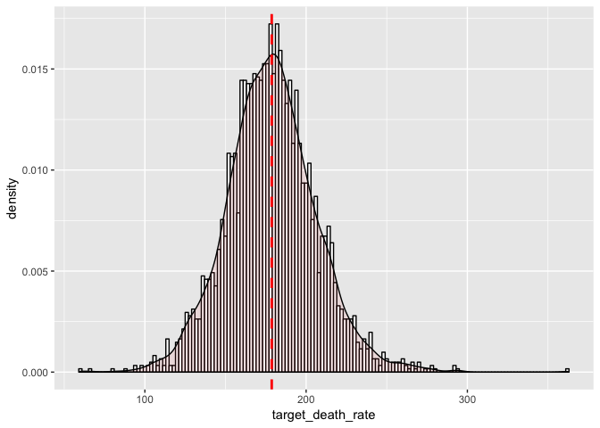

Data\_manipulation
================
Shan Jiang, Jieqi Tu
12/7/2018

``` r
library(readr)
library(tidyverse)
library(Hmisc)
```

``` r
# Import data
cancer_raw = readr::read_csv("./Data/Cancer_Registry.csv") %>% 
  janitor::clean_names() 

## Deacribe the statistics: glimpse
statistics <- describe(cancer_raw)
statistics 
```

    ## cancer_raw 
    ## 
    ##  34  Variables      3047  Observations
    ## ---------------------------------------------------------------------------
    ## avg_ann_count 
    ##        n  missing distinct     Info     Mean      Gmd      .05      .10 
    ##     3047        0      929        1    606.3    856.7       23       37 
    ##      .25      .50      .75      .90      .95 
    ##       76      171      518     1963     1972 
    ## 
    ## lowest :     6     7     8     9    10, highest: 13294 14477 15470 24965 38150
    ## ---------------------------------------------------------------------------
    ## avg_deaths_per_year 
    ##        n  missing distinct     Info     Mean      Gmd      .05      .10 
    ##     3047        0      608        1      186    262.2      9.0     14.0 
    ##      .25      .50      .75      .90      .95 
    ##     28.0     61.0    149.0    378.4    749.4 
    ## 
    ## lowest :     3     4     5     6     7, highest:  4895  5108  5780  9445 14010
    ## ---------------------------------------------------------------------------
    ## target_death_rate 
    ##        n  missing distinct     Info     Mean      Gmd      .05      .10 
    ##     3047        0     1053        1    178.7    30.67    134.1    145.4 
    ##      .25      .50      .75      .90      .95 
    ##    161.2    178.1    195.2    213.3    224.4 
    ## 
    ## lowest :  59.7  66.3  80.8  87.6  93.8, highest: 277.6 280.8 292.5 293.9 362.8
    ## ---------------------------------------------------------------------------
    ## incidence_rate 
    ##        n  missing distinct     Info     Mean      Gmd      .05      .10 
    ##     3047        0     1506        1    448.3    57.33    355.1    380.8 
    ##      .25      .50      .75      .90      .95 
    ##    420.3    453.5    480.9    507.3    525.0 
    ## 
    ## lowest :  201.3  211.1  214.8  221.5  234.0, highest:  639.7  651.3  718.9 1014.2 1206.9
    ## ---------------------------------------------------------------------------
    ## med_income 
    ##        n  missing distinct     Info     Mean      Gmd      .05      .10 
    ##     3047        0     2920        1    47063    12717    31838    34212 
    ##      .25      .50      .75      .90      .95 
    ##    38882    45207    52492    61323    69964 
    ## 
    ## lowest :  22640  23047  24035  24265  24707, highest: 107250 108477 110507 122641 125635
    ## ---------------------------------------------------------------------------
    ## pop_est2015 
    ##        n  missing distinct     Info     Mean      Gmd      .05      .10 
    ##     3047        0     2999        1   102637   153938     3666     5796 
    ##      .25      .50      .75      .90      .95 
    ##    11684    26643    68671   207791   436220 
    ## 
    ## lowest :      827      829     1130     1310     1330
    ## highest:  3299521  4167947  4538028  5238216 10170292
    ## ---------------------------------------------------------------------------
    ## poverty_percent 
    ##        n  missing distinct     Info     Mean      Gmd      .05      .10 
    ##     3047        0      333        1    16.88    7.026     8.30     9.80 
    ##      .25      .50      .75      .90      .95 
    ##    12.15    15.90    20.40    25.30    28.70 
    ## 
    ## lowest :  3.2  3.7  3.9  4.0  4.2, highest: 44.0 45.1 46.9 47.0 47.4
    ## ---------------------------------------------------------------------------
    ## study_per_cap 
    ##        n  missing distinct     Info     Mean      Gmd      .05      .10 
    ##     3047        0     1117    0.745    155.4    272.2     0.00     0.00 
    ##      .25      .50      .75      .90      .95 
    ##     0.00     0.00    83.65   412.81   747.58 
    ## 
    ## lowest :    0.000000    1.481842    2.887570    5.030485    5.033625
    ## highest: 4938.271605 6810.442679 8585.924288 9439.200444 9762.308998
    ## ---------------------------------------------------------------------------
    ## binned_inc 
    ##        n  missing distinct 
    ##     3047        0       10 
    ## 
    ## (34218.1, 37413.8] (304, 0.100), (37413.8, 40362.7] (304, 0.100),
    ## (40362.7, 42724.4] (304, 0.100), (42724.4, 45201] (305, 0.100), (45201,
    ## 48021.6] (306, 0.100), (48021.6, 51046.4] (305, 0.100), (51046.4, 54545.6]
    ## (305, 0.100), (54545.6, 61494.5] (306, 0.100), (61494.5, 125635] (302,
    ## 0.099), [22640, 34218.1] (306, 0.100)
    ## ---------------------------------------------------------------------------
    ## median_age 
    ##        n  missing distinct     Info     Mean      Gmd      .05      .10 
    ##     3047        0      325        1    45.27    14.48    31.93    34.50 
    ##      .25      .50      .75      .90      .95 
    ##    37.70    41.00    44.00    47.70    50.17 
    ## 
    ## lowest :  22.3  23.2  23.3  23.5  23.9, highest: 536.4 546.0 579.6 619.2 624.0
    ## ---------------------------------------------------------------------------
    ## median_age_male 
    ##        n  missing distinct     Info     Mean      Gmd      .05      .10 
    ##     3047        0      298        1    39.57    5.792    31.00    33.20 
    ##      .25      .50      .75      .90      .95 
    ##    36.35    39.60    42.50    46.10    48.60 
    ## 
    ## lowest : 22.4 22.8 23.0 23.7 23.8, highest: 56.5 58.5 58.6 60.2 64.7
    ## ---------------------------------------------------------------------------
    ## median_age_female 
    ##        n  missing distinct     Info     Mean      Gmd      .05      .10 
    ##     3047        0      296        1    42.15    5.881     32.9     35.4 
    ##      .25      .50      .75      .90      .95 
    ##     39.1     42.4     45.3     48.6     50.6 
    ## 
    ## lowest : 22.3 22.8 23.6 23.9 24.5, highest: 58.0 58.2 58.7 59.6 65.7
    ## ---------------------------------------------------------------------------
    ## geography 
    ##        n  missing distinct 
    ##     3047        0     3047 
    ## 
    ## lowest : Abbeville County, South Carolina  Acadia Parish, Louisiana          Accomack County, Virginia         Ada County, Idaho                 Adair County, Iowa               
    ## highest: Yukon-Koyukuk Census Area, Alaska Yuma County, Arizona              Yuma County, Colorado             Zapata County, Texas              Zavala County, Texas             
    ## ---------------------------------------------------------------------------
    ## avg_household_size 
    ##        n  missing distinct     Info     Mean      Gmd      .05      .10 
    ##     3047        0      199        1     2.48   0.3509     2.14     2.24 
    ##      .25      .50      .75      .90      .95 
    ##     2.37     2.50     2.63     2.82     2.98 
    ## 
    ## lowest : 0.0221 0.0222 0.0225 0.0230 0.0236, highest: 3.7800 3.8400 3.8600 3.9300 3.9700
    ## ---------------------------------------------------------------------------
    ## percent_married 
    ##        n  missing distinct     Info     Mean      Gmd      .05      .10 
    ##     3047        0      362        1    51.77    7.612    39.30    43.06 
    ##      .25      .50      .75      .90      .95 
    ##    47.75    52.40    56.40    59.94    61.90 
    ## 
    ## lowest : 23.1 25.1 25.3 26.2 26.3, highest: 68.0 69.1 69.2 72.3 72.5
    ## ---------------------------------------------------------------------------
    ## pct_no_hs18_24 
    ##        n  missing distinct     Info     Mean      Gmd      .05      .10 
    ##     3047        0      405        1    18.22    8.802     6.90     9.00 
    ##      .25      .50      .75      .90      .95 
    ##    12.80    17.10    22.70    28.60    32.87 
    ## 
    ## lowest :  0.0  0.5  0.8  1.2  1.4, highest: 59.0 59.1 59.7 62.7 64.1
    ## ---------------------------------------------------------------------------
    ## pct_hs18_24 
    ##        n  missing distinct     Info     Mean      Gmd      .05      .10 
    ##     3047        0      469        1       35     10.1    20.40    23.66 
    ##      .25      .50      .75      .90      .95 
    ##    29.20    34.70    40.70    46.10    50.60 
    ## 
    ## lowest :  0.0  7.1  8.0  8.6 10.0, highest: 65.5 65.7 66.2 72.1 72.5
    ## ---------------------------------------------------------------------------
    ## pct_some_col18_24 
    ##        n  missing distinct     Info     Mean      Gmd      .05      .10 
    ##      762     2285      343        1    40.98    12.24    24.52    27.81 
    ##      .25      .50      .75      .90      .95 
    ##    34.00    40.40    46.40    56.18    60.87 
    ## 
    ## lowest :  7.1  9.6 10.1 11.2 11.4, highest: 73.5 75.2 76.2 78.3 79.0
    ## ---------------------------------------------------------------------------
    ## pct_bach_deg18_24 
    ##        n  missing distinct     Info     Mean      Gmd      .05      .10 
    ##     3047        0      219        1    6.158    4.681      0.5      1.4 
    ##      .25      .50      .75      .90      .95 
    ##      3.1      5.4      8.2     11.7     14.3 
    ## 
    ## lowest :  0.0  0.1  0.2  0.3  0.4, highest: 33.3 37.5 40.3 43.4 51.8
    ## ---------------------------------------------------------------------------
    ## pct_hs25_over 
    ##        n  missing distinct     Info     Mean      Gmd      .05      .10 
    ##     3047        0      361        1     34.8    7.906    22.23    25.60 
    ##      .25      .50      .75      .90      .95 
    ##    30.40    35.30    39.65    43.40    45.40 
    ## 
    ## lowest :  7.5  8.3 10.8 11.5 11.8, highest: 51.7 52.1 52.7 53.6 54.8
    ## ---------------------------------------------------------------------------
    ## pct_bach_deg25_over 
    ##        n  missing distinct     Info     Mean      Gmd      .05      .10 
    ##     3047        0      281        1    13.28    5.855     6.40     7.40 
    ##      .25      .50      .75      .90      .95 
    ##     9.40    12.30    16.10    20.40    23.47 
    ## 
    ## lowest :  2.5  2.7  3.2  3.4  3.9, highest: 35.8 37.8 39.7 40.4 42.2
    ## ---------------------------------------------------------------------------
    ## pct_employed16_over 
    ##        n  missing distinct     Info     Mean      Gmd      .05      .10 
    ##     2895      152      409        1    54.15    9.362    39.97    43.50 
    ##      .25      .50      .75      .90      .95 
    ##    48.60    54.50    60.30    64.40    66.50 
    ## 
    ## lowest : 17.6 19.5 22.1 23.9 24.0, highest: 74.3 74.4 75.9 76.5 80.1
    ## ---------------------------------------------------------------------------
    ## pct_unemployed16_over 
    ##        n  missing distinct     Info     Mean      Gmd      .05      .10 
    ##     3047        0      195        1    7.852    3.765      2.8      3.8 
    ##      .25      .50      .75      .90      .95 
    ##      5.5      7.6      9.7     12.2     13.8 
    ## 
    ## lowest :  0.4  0.5  0.7  0.8  0.9, highest: 25.3 25.4 26.8 27.0 29.4
    ## ---------------------------------------------------------------------------
    ## pct_private_coverage 
    ##        n  missing distinct     Info     Mean      Gmd      .05      .10 
    ##     3047        0      498        1    64.35    12.02    46.40    50.30 
    ##      .25      .50      .75      .90      .95 
    ##    57.20    65.10    72.10    77.60    80.57 
    ## 
    ## lowest : 22.3 23.4 25.0 27.2 27.8, highest: 88.0 88.8 88.9 89.6 92.3
    ## ---------------------------------------------------------------------------
    ## pct_private_coverage_alone 
    ##        n  missing distinct     Info     Mean      Gmd      .05      .10 
    ##     2438      609      459        1    48.45    11.48    32.48    35.30 
    ##      .25      .50      .75      .90      .95 
    ##    41.00    48.70    55.60    61.60    65.02 
    ## 
    ## lowest : 15.7 16.8 19.6 20.7 22.2, highest: 76.5 76.6 77.1 78.2 78.9
    ## ---------------------------------------------------------------------------
    ## pct_emp_priv_coverage 
    ##        n  missing distinct     Info     Mean      Gmd      .05      .10 
    ##     3047        0      450        1     41.2    10.73    26.00    28.90 
    ##      .25      .50      .75      .90      .95 
    ##    34.50    41.10    47.70    53.74    56.80 
    ## 
    ## lowest : 13.5 14.3 15.0 16.3 16.8, highest: 68.8 68.9 69.2 70.2 70.7
    ## ---------------------------------------------------------------------------
    ## pct_public_coverage 
    ##        n  missing distinct     Info     Mean      Gmd      .05      .10 
    ##     3047        0      395        1    36.25    8.864    23.00    26.10 
    ##      .25      .50      .75      .90      .95 
    ##    30.90    36.30    41.55    46.20    49.00 
    ## 
    ## lowest : 11.2 11.8 13.5 13.8 14.0, highest: 58.5 59.3 62.2 62.7 65.1
    ## ---------------------------------------------------------------------------
    ## pct_public_coverage_alone 
    ##        n  missing distinct     Info     Mean      Gmd      .05      .10 
    ##     3047        0      319        1    19.24    6.849    10.00    11.80 
    ##      .25      .50      .75      .90      .95 
    ##    14.85    18.80    23.10    27.00    29.90 
    ## 
    ## lowest :  2.6  2.7  4.2  4.6  5.0, highest: 40.6 41.4 41.9 43.3 46.6
    ## ---------------------------------------------------------------------------
    ## pct_white 
    ##        n  missing distinct     Info     Mean      Gmd      .05      .10 
    ##     3047        0     3044        1    83.65    16.43    47.96    60.42 
    ##      .25      .50      .75      .90      .95 
    ##    77.30    90.06    95.45    97.20    97.77 
    ## 
    ## lowest :  10.19916  11.00876  12.01620  12.27367  13.62272
    ## highest:  99.61528  99.64629  99.69304  99.84590 100.00000
    ## ---------------------------------------------------------------------------
    ## pct_black 
    ##        n  missing distinct     Info     Mean      Gmd      .05      .10 
    ##     3047        0     2972        1    9.108    12.83   0.1007   0.2485 
    ##      .25      .50      .75      .90      .95 
    ##   0.6207   2.2476  10.5097  30.3715  42.1703 
    ## 
    ## lowest :  0.000000000  0.009738995  0.012794268  0.013453518  0.013691128
    ## highest: 80.659997700 81.281846340 82.559130620 84.866023580 85.947798580
    ## ---------------------------------------------------------------------------
    ## pct_asian 
    ##        n  missing distinct     Info     Mean      Gmd      .05      .10 
    ##     3047        0     2852        1    1.254     1.63   0.0000   0.0578 
    ##      .25      .50      .75      .90      .95 
    ##   0.2542   0.5498   1.2210   2.8123   4.4719 
    ## 
    ## lowest :  0.000000000  0.006028454  0.007154611  0.007464915  0.007917030
    ## highest: 33.760904510 33.829509620 35.640183090 37.156931740 42.619424540
    ## ---------------------------------------------------------------------------
    ## pct_other_race 
    ##        n  missing distinct     Info     Mean      Gmd      .05      .10 
    ##     3047        0     2903        1    1.984    2.604  0.01408  0.08920 
    ##      .25      .50      .75      .90      .95 
    ##  0.29517  0.82619  2.17796  4.84393  7.85840 
    ## 
    ## lowest :  0.000000000  0.005558026  0.007952286  0.009243853  0.010645093
    ## highest: 36.828519600 37.610993660 37.859022640 38.743746530 41.930251420
    ## ---------------------------------------------------------------------------
    ## pct_married_households 
    ##        n  missing distinct     Info     Mean      Gmd      .05      .10 
    ##     3047        0     3043        1    51.24    7.176    39.73    43.11 
    ##      .25      .50      .75      .90      .95 
    ##    47.76    51.67    55.40    58.67    60.99 
    ## 
    ## lowest : 22.99249 23.88563 23.91565 24.02463 24.42908
    ## highest: 70.78125 71.12701 71.40010 71.70306 78.07540
    ## ---------------------------------------------------------------------------
    ## birth_rate 
    ##        n  missing distinct     Info     Mean      Gmd      .05      .10 
    ##     3047        0     3019        1     5.64    2.071    2.875    3.563 
    ##      .25      .50      .75      .90      .95 
    ##    4.521    5.381    6.494    7.984    9.185 
    ## 
    ## lowest :  0.0000000  0.2840909  0.3636364  0.4132231  0.4767580
    ## highest: 17.2605791 17.4010456 17.8770950 18.5567010 21.3261649
    ## ---------------------------------------------------------------------------

``` r
# Check NA values for each column
n_NA = sapply(cancer_raw[1:34], function(x) sum(length(which(is.na(x)))))
n_NA
```

    ##              avg_ann_count        avg_deaths_per_year 
    ##                          0                          0 
    ##          target_death_rate             incidence_rate 
    ##                          0                          0 
    ##                 med_income                pop_est2015 
    ##                          0                          0 
    ##            poverty_percent              study_per_cap 
    ##                          0                          0 
    ##                 binned_inc                 median_age 
    ##                          0                          0 
    ##            median_age_male          median_age_female 
    ##                          0                          0 
    ##                  geography         avg_household_size 
    ##                          0                          0 
    ##            percent_married             pct_no_hs18_24 
    ##                          0                          0 
    ##                pct_hs18_24          pct_some_col18_24 
    ##                          0                       2285 
    ##          pct_bach_deg18_24              pct_hs25_over 
    ##                          0                          0 
    ##        pct_bach_deg25_over        pct_employed16_over 
    ##                          0                        152 
    ##      pct_unemployed16_over       pct_private_coverage 
    ##                          0                          0 
    ## pct_private_coverage_alone      pct_emp_priv_coverage 
    ##                        609                          0 
    ##        pct_public_coverage  pct_public_coverage_alone 
    ##                          0                          0 
    ##                  pct_white                  pct_black 
    ##                          0                          0 
    ##                  pct_asian             pct_other_race 
    ##                          0                          0 
    ##     pct_married_households                 birth_rate 
    ##                          0                          0

``` r
# Check the percentage of NA values for each column
percentage_NA = sapply(cancer_raw[1:34], function(x) sum(length(which(is.na(x)))) / 3047)
percentage_NA
```

    ##              avg_ann_count        avg_deaths_per_year 
    ##                 0.00000000                 0.00000000 
    ##          target_death_rate             incidence_rate 
    ##                 0.00000000                 0.00000000 
    ##                 med_income                pop_est2015 
    ##                 0.00000000                 0.00000000 
    ##            poverty_percent              study_per_cap 
    ##                 0.00000000                 0.00000000 
    ##                 binned_inc                 median_age 
    ##                 0.00000000                 0.00000000 
    ##            median_age_male          median_age_female 
    ##                 0.00000000                 0.00000000 
    ##                  geography         avg_household_size 
    ##                 0.00000000                 0.00000000 
    ##            percent_married             pct_no_hs18_24 
    ##                 0.00000000                 0.00000000 
    ##                pct_hs18_24          pct_some_col18_24 
    ##                 0.00000000                 0.74991795 
    ##          pct_bach_deg18_24              pct_hs25_over 
    ##                 0.00000000                 0.00000000 
    ##        pct_bach_deg25_over        pct_employed16_over 
    ##                 0.00000000                 0.04988513 
    ##      pct_unemployed16_over       pct_private_coverage 
    ##                 0.00000000                 0.00000000 
    ## pct_private_coverage_alone      pct_emp_priv_coverage 
    ##                 0.19986872                 0.00000000 
    ##        pct_public_coverage  pct_public_coverage_alone 
    ##                 0.00000000                 0.00000000 
    ##                  pct_white                  pct_black 
    ##                 0.00000000                 0.00000000 
    ##                  pct_asian             pct_other_race 
    ##                 0.00000000                 0.00000000 
    ##     pct_married_households                 birth_rate 
    ##                 0.00000000                 0.00000000

There are in total 34 variables and 3047observations in the dataset.

  - The outcome variable in this datset is `target_death
    rate`(Continuous VARIABLE);

  - There are remaining 33 predictors avaliable for use.

### Here are descriptive statistics for `target_death rate`

we first need to look at the distributions of our outcome variable.

``` r
cancer_raw %>% 
  ggplot(aes(x = target_death_rate)) + 
    geom_histogram(aes(y = ..density..),  
                   binwidth = 2, colour = "black", fill = "white") +
    geom_density(alpha = .1, fill = "#FF6666") +
    geom_vline(aes(xintercept = mean(target_death_rate, na.rm = T)),   # Ignore NA values for mean
               color = "red", linetype = "dashed", size = 1)# Overlay with transparent density plot
```

<!-- -->

### Data cleaning

``` r
# Discard columns that have more than 10% NA values 
cancer_raw = 
  cancer_raw %>% 
  select(-pct_private_coverage, -pct_some_col18_24)

# Create a new dataset for type (a) variables
cancer_a_raw = 
  cancer_raw %>% 
  select(target_death_rate, avg_ann_count, avg_deaths_per_year, incidence_rate, study_per_cap)

# Create a new dataset for type (b) variables
cancer_b_raw = 
  cancer_raw %>% 
  select(-target_death_rate, -avg_ann_count, -avg_deaths_per_year, -incidence_rate, -study_per_cap)
```

``` r
cancer_b_raw =
  cancer_b_raw %>% 
  # select median age as the only predictor to reflect the population age level
  select(-median_age_male, -median_age_female) %>% 
  # select median income as the only predictor to relect the population income level
  select(-binned_inc) %>% 
  # select percentage of residents employed as the only predictor to relect the population employment level
  select(-pct_unemployed16_over) %>% 
  # select percent of county residents with private health coverage as the only predictor to relect the population health coverage level
  select(-pct_private_coverage_alone) %>% 
  # select percentage of whits as the only predictor to relect the race proportion
  select(-pct_black, -pct_asian)
```

### Here are descriptive statistics for predictors

### Variable selection

We are only interested in working with a subset of the most relevant
variables.

  - For combination of *race*:we combined the `pct_white`, `pct_black`,
    `pct_asian`, `pct_other_race`.

<!-- end list -->

``` r
## categorical variable 


##
```

## Multiple Linear Regression
